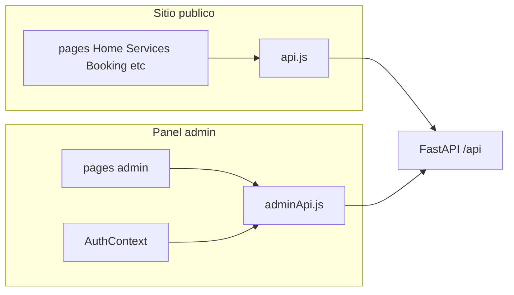
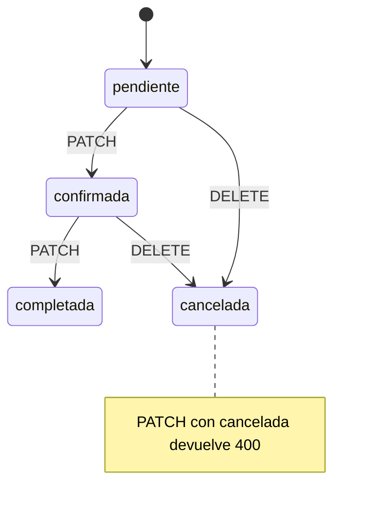

# Plan de refactorización del frontend (alineación con backend)

**Resumen:** Plan por fases para alinear el frontend React/Vite con el contrato actual del backend FastAPI (auth JWT, paginación, reservas con DELETE para cancelar, servicios como lista plana, galería/reseñas paginadas) y preparar cambios de negocio documentados en el backend (rejilla :00/:30, barbero Jonathan, limpieza de `servicio_nombre`).

## Checklist de fases

- [ ] **Fase 0:** Crear `client.js` compartido, `resolveMediaUrl`, corregir export CSV y upload galería, convención de barras finales en api público
- [ ] **Fase 1:** Dividir servicios por dominio (bookings, services, reviews, gallery, contact, auth, stats) y actualizar README con tabla de contratos
- [ ] **Fase 2:** Refactor `Booking.jsx` (payload, timezone, errores, barbero) y `AdminReservas` (paginación servidor, CSS extraído)
- [ ] **Fase 3:** Mejorar `useApi`/hooks paginados; alinear Home, Gallery, Reviews, Contact y páginas admin restantes
- [ ] **Fase 4:** Interceptor 401 global en cliente admin + integración con `AuthContext`
- [ ] **Fase 5:** Actualizar MSW handlers y tests unitarios/integración; verificar build con `VITE_API_URL`
- [ ] **Fase 6 (post-backend):** Rejilla :00/:30, `duracion_minutos`, Jonathan, horarios de apertura cuando estén en `main`

---

## Diagnóstico: estado actual

### Backend (referencia de contrato)

Arquitectura en capas (`domain` / `infrastructure` / `api`), routers montados en [`backend/app/main.py`](../../backend/app/main.py):

| Dominio | Forma de respuesta | Auth | Notas clave |
|---------|-------------------|------|-------------|
| Servicios `GET /api/services/` | **Array** `ServiceOut[]` | Público; `solo_activos=false` solo con JWT | Fuente: [`backend/app/api/routers/services.py`](../../backend/app/api/routers/services.py) |
| Reseñas `GET /api/reviews/` | **PagedResponse** | Público; `solo_visibles=false` solo con JWT | [`backend/app/api/schemas/pagination.py`](../../backend/app/api/schemas/pagination.py) |
| Galería `GET /api/gallery/` | **PagedResponse** | Público (solo visibles) | Upload: `POST /api/gallery/upload` (5 MB, Pillow) |
| Reservas públicas | `POST /`, `GET /disponibilidad` | Público + rate limit | 409 si slot ocupado; nombre servicio desde BD |
| Reservas admin | `GET /` paginado, `PATCH`, `DELETE`, `GET /export` | JWT | **Cancelar = DELETE** (no PATCH `cancelada`) |
| Stats | `GET /api/admin/stats` | JWT | [`backend/app/api/schemas/stats.py`](../../backend/app/api/schemas/stats.py) |
| Auth | `POST /api/auth/login` (OAuth2 form) | — | `username` + `password` → `access_token` |

Reglas de negocio ya implementadas en backend:

- `UpdateBookingUseCase` rechaza `estado: "cancelada"` → 400 ([`backend/app/domain/booking/use_cases.py`](../../backend/app/domain/booking/use_cases.py)).
- `BookingCreate` acepta `servicio_nombre` en schema pero el router **lo ignora** y persiste `service.nombre` ([`backend/app/api/routers/bookings.py`](../../backend/app/api/routers/bookings.py)).
- `DEFAULT_BARBER = "Cualquier barbero"` ([`backend/app/core/constants.py`](../../backend/app/core/constants.py)); roadmap en [`backend/docs/plan_mejoras_post_auditoria.md`](../../backend/docs/plan_mejoras_post_auditoria.md).

### Frontend (estado y desalineaciones)



**Lo que ya está bien alineado**

- Login OAuth2 form en [`frontend/src/services/adminApi.js`](../src/services/adminApi.js) + [`frontend/src/contexts/AuthContext.jsx`](../src/contexts/AuthContext.jsx).
- Admin reservas: confirmar/completar vía `PATCH`; cancelar vía `DELETE` ([`frontend/src/pages/admin/AdminReservas.jsx`](../src/pages/admin/AdminReservas.jsx)).
- Reseñas y galería públicas leen `data.items` ([`frontend/src/pages/Reviews.jsx`](../src/pages/Reviews.jsx), [`frontend/src/pages/Gallery.jsx`](../src/pages/Gallery.jsx)).
- Servicios públicos tratan `res.data` como array ([`frontend/src/pages/Services.jsx`](../src/pages/Services.jsx), [`frontend/src/pages/Home.jsx`](../src/pages/Home.jsx)).
- Tests con Vitest + MSW (cobertura razonable en servicios y admin).

**Brechas críticas (rompen o confunden en producción)**

| # | Problema | Impacto |
|---|----------|---------|
| B1 | `exportBookingsCSV` y `uploadGalleryImage` usan URLs fijas `/api/...` sin `VITE_API_URL` | Falla en Docker/producción cuando el API no está en el mismo origin |
| B2 | Rutas públicas en `api.js` sin barra final (`/bookings`, `/services`) vs admin con `/bookings/` | Riesgo de 307; en admin ya se documentó pérdida de `Authorization` en redirects |
| B3 | [`Booking.jsx`](../src/pages/Booking.jsx) envía `servicio_nombre` innecesario | Contrato engañoso; código muerto |
| B4 | Selector de barbero público (`Cualquier barbero`, `Barbero 1`…) vs backend que fija nombre desde BD/constante | UX incoherente con negocio (Jonathan) |
| B5 | `isoToHHMM` sobre ISO UTC (`toISOString`) vs slots en hora local | Desfase de disponibilidad en algunos husos |
| B6 | MSW mocks desactualizados (`url` vs `imagen_url`, rutas sin barra) | Tests que no reflejan API real |

**Deuda estructural (no bloquea, pero frena mantenimiento)**

- Dos clientes Axios duplicados sin módulo común de `baseURL`, errores ni tipos.
- ~500+ líneas de CSS inline en componentes admin (p. ej. `AdminReservas`).
- `useApi` genérico sin revalidación, sin parseo de errores 422/429, sin distinción lista vs paginado.
- Placeholders en Gallery/Services cuando la API devuelve `[]` (no distinguen “vacío real” vs error).
- URLs de imágenes `/uploads/...` relativas: en producción con `VITE_API_URL` pueden requerir prefijo del host del API.

---

## Objetivo del refactor

1. **Contrato único** frontend ↔ OpenAPI del backend (formas de respuesta, métodos HTTP, query params).
2. **Capa API centralizada** que funcione igual en dev (proxy Vite) y prod (`VITE_API_URL`).
3. **Módulos por dominio** (bookings, services, reviews, gallery, contact, auth, stats) consumidos por páginas delgadas.
4. **Preparación** para mejoras backend planificadas (rejilla :00/:30, `duracion_minutos`, barbero Jonathan) sin reescribir UI dos veces.

**Fuera de alcance recomendado en esta iteración** (salvo que lo pidas explícitamente): migración a TypeScript, rediseño visual completo, i18n.

---

## Fase 0 — Fundación de la capa HTTP (prioridad alta)

### 0.1 Módulo compartido de cliente

Crear p. ej. [`frontend/src/services/http/client.js`](../src/services/http/client.js):

- `getApiBase()` → `import.meta.env.VITE_API_URL ? \`${VITE_API_URL}/api\` : '/api'`.
- `getOrigin()` → host sin `/api` (para resolver `/uploads/...`).
- Factory `createClient({ withAuth: boolean })` con interceptores:
  - Request: `Authorization` si `withAuth` y token en `localStorage` (`bulls_admin_token`).
  - Response: normalizar errores FastAPI (`detail` string | array de validación) → `ApiError` con `status`, `message`, `fields`.

Refactorizar [`api.js`](../src/services/api.js) y [`adminApi.js`](../src/services/adminApi.js) para reexportar desde módulos de dominio (mantener exports actuales temporalmente para no romper imports).

### 0.2 Convención de rutas (alineada con FastAPI)

| Tipo | Convención |
|------|------------|
| Colecciones | Siempre con barra final: `/services/`, `/bookings/`, `/reviews/`, `/gallery/`, `/contact/` |
| Recursos | Sin barra: `/bookings/{id}`, `/reviews/{id}/visibilidad` |
| Acciones | `/bookings/export`, `/gallery/upload`, `/auth/login` |

Aplicar en **público y admin** para evitar redirects 307.

### 0.3 Utilidad de URLs de medios

`resolveMediaUrl(path)` — si `path` empieza por `/uploads`, prefijar `getOrigin()` cuando hay `VITE_API_URL`. Usar en [`Gallery.jsx`](../src/pages/Gallery.jsx), [`ServiceCard.jsx`](../src/components/ServiceCard.jsx), [`AdminGaleria.jsx`](../src/pages/admin/AdminGaleria.jsx).

### 0.4 Corregir B1 de inmediato

- `exportBookingsCSV`: usar `getApiBase() + '/bookings/export?...'` con `fetch` + Bearer (o axios `responseType: 'blob'`).
- `uploadGalleryImage`: `xhr.open('POST', getApiBase() + '/gallery/upload')`.

---

## Fase 1 — Contratos por dominio (API modules)

Estructura propuesta:

```
frontend/src/services/
  http/client.js
  http/errors.js
  bookings/public.js      # createBooking, getDisponibilidad
  bookings/admin.js       # list, patch, delete, export
  services/public.js
  services/admin.js
  reviews/public.js
  reviews/admin.js
  gallery/public.js
  gallery/admin.js
  contact/public.js
  contact/admin.js
  auth/admin.js
  stats/admin.js
  index.js                # re-exports legacy api.js / adminApi.js
```

### Mapeo contrato → funciones

**Bookings (público)** — schema [`BookingCreate`](../../backend/app/api/schemas/booking.py):

```js
// Payload mínimo alineado
{
  nombre_cliente, telefono,
  email?, servicio_id, fecha_hora,  // ISO 8601
  barbero?, notas?
  // NO servicio_nombre
}
```

**Bookings (admin)** — `PagedResponse<BookingOut>` con query `page`, `size`, `estado`.

**Servicios** — `GET` devuelve array; admin `solo_activos: false` con JWT.

**Reseñas / Galería / Contacto (admin)** — paginación `page`, `size`; contacto `solo_no_leidos`.

Documentar en [`frontend/README.md`](../README.md) una tabla espejo de [`backend/README.md`](../../backend/README.md) (endpoints + formas de respuesta).

---

## Fase 2 — Reservas: alineación funcional (prioridad alta)

### 2.1 Formulario público [`Booking.jsx`](../src/pages/Booking.jsx)

| Cambio | Detalle |
|--------|---------|
| Quitar `servicio_nombre` del POST | Mostrar nombre solo en UI desde `services` |
| Ocultar o fijar barbero | Eliminar select `BARBEROS`; no enviar `barbero` (backend usa `DEFAULT_BARBER`) o enviar `"Jonathan"` cuando el backend actualice la constante |
| Fecha/hora local → API | Construir `fecha_hora` como string local ISO sin conversión UTC errónea (p. ej. `formatLocalISO(date, hour, minute)`), o enviar offset explícito acordado con backend |
| Disponibilidad | Mantener `slots_ocupados`; al parsear, comparar en **misma zona** que se envía en el POST |
| Errores | 409 → mensaje `detail` + refresco slots; 422 → mostrar validación; 429 → toast “Demasiados intentos” |
| Horarios UI | Extraer `HORARIOS` a config (`bookingConfig.js`) para cuando el backend imponga rejilla :00/:30 |

### 2.2 Panel admin [`AdminReservas.jsx`](../src/pages/admin/AdminReservas.jsx)

| Cambio | Detalle |
|--------|---------|
| Paginación servidor | Sustituir carga única `size: 200` por `listBookings({ page, size, estado })` usando `total`, `pages` del backend |
| Búsqueda | Opción A: query param si el backend lo añade después; Opción B (corto plazo): mantener filtro client-side solo sobre la página actual y documentar límite |
| Estado tras DELETE | Tras cancelar, refrescar lista o marcar `deleted_at` si el listado sigue devolviendo canceladas |
| Extraer estilos | Mover CSS inline a [`frontend/src/pages/admin/AdminReservas.css`](../src/pages/admin/AdminReservas.css) |

Flujo de estados (ya correcto en intención):



---

## Fase 3 — Capa de datos en UI (hooks)

### 3.1 Evolucionar [`useApi.js`](../src/hooks/useApi.js)

- `useApi(apiFn, deps, { select: (res) => res.data })` para normalizar lista vs `{ items }`.
- `parseApiError(err)` compartido con el cliente HTTP.
- Hooks especializados (opcional pero recomendado):
  - `usePagedQuery(fn, { page, size, ...filters })`
  - `useMutation(fn)` con `loading` / `error` para formularios (Booking, Contact, Reviews).

### 3.2 Páginas públicas

| Página | Ajuste |
|--------|--------|
| [`Home.jsx`](../src/pages/Home.jsx) | `getReviews({ page: 1, size: 3 })`; servicios ya OK como array |
| [`Services.jsx`](../src/pages/Services.jsx) | Placeholder solo si `error`; si `[]` mostrar empty state |
| [`Gallery.jsx`](../src/pages/Gallery.jsx) | `getGallery({ page: 1, size: 50 })`; `resolveMediaUrl`; quitar placeholder si hay datos reales |
| [`Reviews.jsx`](../src/pages/Reviews.jsx) | Paginación o “cargar más”; tras `createReview`, invalidar lista |
| [`Contact.jsx`](../src/pages/Contact.jsx) | Mapear errores 422 en campos |

### 3.3 Panel admin restante

- [`AdminDashboard.jsx`](../src/pages/admin/AdminDashboard.jsx): tipar mentalmente contra `StatsOut` (nombres ya coinciden).
- [`AdminServicios.jsx`](../src/pages/admin/AdminServicios.jsx): PUT parcial vía `exclude_unset` en backend — enviar solo campos modificados en edición.
- [`AdminResenas.jsx`](../src/pages/admin/AdminResenas.jsx): paginación servidor + `toggleReviewVisibility(id, visible)`.
- [`AdminGaleria.jsx`](../src/pages/admin/AdminGaleria.jsx): validación cliente 5 MB y extensiones antes de subir (espejo backend).
- [`AdminMensajes.jsx`](../src/pages/admin/AdminMensajes.jsx): `solo_no_leidos` en filtro de chips.

---

## Fase 4 — Auth y seguridad de sesión

En [`AuthContext.jsx`](../src/contexts/AuthContext.jsx) + cliente HTTP:

- Interceptor **response** 401 en rutas admin → `logout()` silencioso + redirect a `/admin/login`.
- Opcional: comprobar expiración antes de cada mutación admin crítica.

No duplicar lógica de token: una sola fuente (`TOKEN_KEY` + interceptor).

---

## Fase 5 — Tests y calidad (paralelo a fases 0–3)

| Área | Acción |
|------|--------|
| [`handlers.js`](../src/__tests__/mocks/handlers.js) | Rutas con barra final; `GalleryImageOut` con `imagen_url`, `titulo`; bookings paginado `{ items, total, page, size, pages }` |
| [`api.test.js`](../src/__tests__/services/api.test.js) / [`adminApi.test.js`](../src/__tests__/services/adminApi.test.js) | Actualizar paths; test `resolveMediaUrl` y export/upload con `VITE_API_URL` mockeado |
| Componentes | Casos 409 en Booking; DELETE cancel en AdminReservas; error 422 en Contact |
| CI | `npm run test` + `npm run build` en pipeline frontend |

---

## Fase 6 — Sincronización con roadmap backend (cuando esté en `main`)

Coordinar con [`backend/docs/plan_mejoras_post_auditoria.md`](../../backend/docs/plan_mejoras_post_auditoria.md):

| Cambio backend | Acción frontend |
|----------------|-----------------|
| Rejilla :00/:30 + `duracion_minutos` | Generar slots desde servicio seleccionado; deshabilitar según solape; no permitir :15/:45 |
| `DEFAULT_BARBER = "Jonathan"` | Quitar UI de barbero definitivamente |
| Quitar `servicio_nombre` de `BookingCreate` | Ya no enviar (Fase 2) |
| Horarios de apertura / festivos | Sustituir `HORARIOS` fijos y `filterDate` por config del API o endpoint de settings |
| Rate limit más estricto | UX 429 centralizada |

Implementar esta fase **después** de Fase 0–2 para no mezclar dos contratos a la vez.

---

## Orden de ejecución recomendado

```mermaid
gantt
  title Refactor frontend por fases
  dateFormat X
  axisFormat %s
  section Critico
  Fase0_HTTP_y_URLs     :0, 3
  Fase1_Modulos_API     :2, 4
  section Core
  Fase2_Reservas        :4, 7
  Fase3_Hooks_y_paginas :5, 8
  section Calidad
  Fase4_Auth            :6, 8
  Fase5_Tests           :3, 9
  section Futuro
  Fase6_Roadmap_BE      :9, 12
```



**Entregables por hito**

1. **Hito A (día 1–2):** Fase 0 completa + tests de regresión en servicios HTTP.
2. **Hito B (día 3–5):** Fase 1 + 2 (bookings público y admin).
3. **Hito C (día 6–8):** Fase 3 (resto páginas) + extracción CSS admin.
4. **Hito D:** Fase 5 verde en CI; README actualizado.
5. **Hito E:** Fase 6 cuando el backend despliegue rejilla/barbero.

---

## Criterios de aceptación globales

- Build de producción con `VITE_API_URL` distinto del origin: login, listados admin, export CSV y upload galería funcionan.
- Crear reserva sin `servicio_nombre`; conflictos 409 manejados.
- Cancelar reserva solo con `DELETE`; nunca `PATCH` con `cancelada`.
- Listados paginados usan `items` + metadatos `total`/`pages` donde el backend pagina.
- Servicios públicos consumen array directo, no `.items`.
- Tests Vitest pasan con handlers alineados al contrato real.
- Sin regresiones en rutas públicas ni panel `/admin/*`.

---

## Riesgos y mitigaciones

| Riesgo | Mitigación |
|--------|------------|
| Redirect 307 pierde JWT | Barras finales en todas las colecciones |
| Zona horaria en slots | Unificar formato enviado y parseo de `slots_ocupados` |
| Refactor grande en un PR | PRs por fase (0 → 1 → 2…) con re-exports legacy |
| Backend cambia contrato en paralelo | Fase 6 explícita; changelog en README backend |
